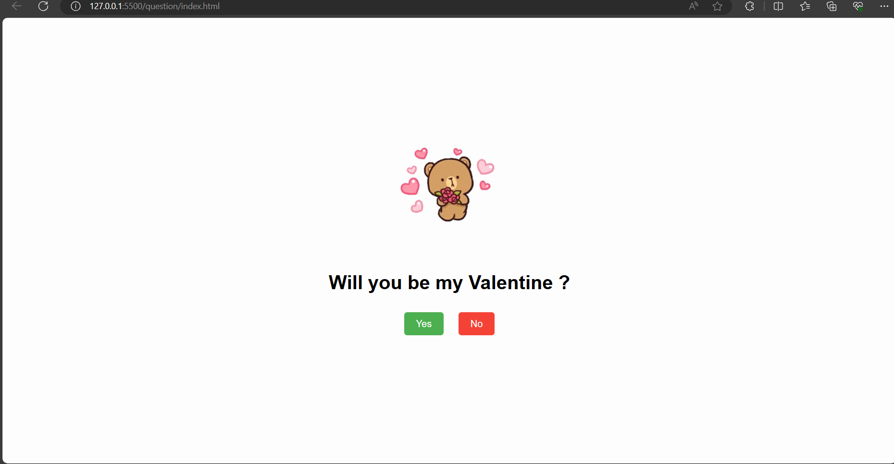

# TeddyBearValentineQuestion 
# OR
# Valentine's Decision Page

This is a simple web page designed for making a Valentine's Day decision. Users can choose whether they want to be someone's Valentine or not by clicking on the "Yes" or "No" buttons, respectively. The page includes a cute teddy bear image that changes each time the user clicks "Yes".

## Usage

1. Clone or download the repository.
2. Open the `index.html` file in a web browser.
3. Click the "Yes" button to accept being someone's Valentine and see the teddy bear change.
4. Click the "No" button if you decline.

## Files Included

- `index.html`: Contains the HTML structure of the web page.
- `script.js`: Includes JavaScript code to handle button clicks and teddy bear image changes.
- `style.css`: Contains the CSS styles for the web page layout and design.

## Preview

## Credits

- Teddy bear images are sourced from [placeholder.com](https://placeholder.com/).
- GIFs are embedded from Tenor: [Jump Bear GIF](https://tenor.com/view/jump-bear-cute-hearts-love-gif-16290134).

